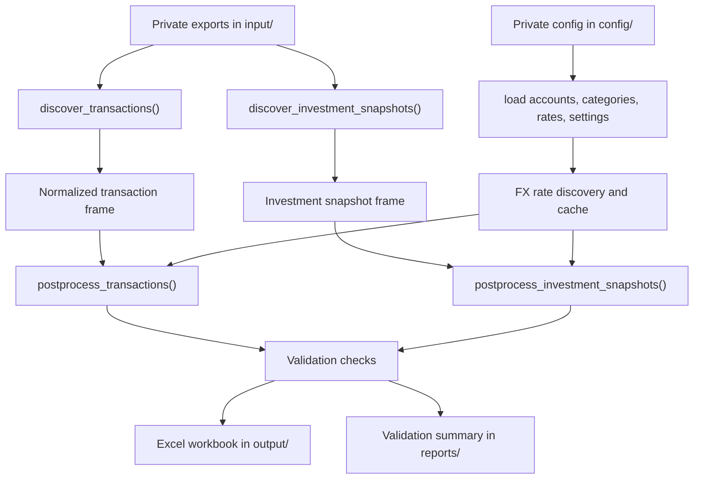

# Pipeline Architecture

The repository is centered on `build_finance_workbook.py`, with source-specific parsing in `bank_parsers/`.

## Main Modules

| Path | Responsibility |
| --- | --- |
| `build_finance_workbook.py` | CLI entrypoint, settings resolution, discovery, post-processing, validation, FX handling, workbook writing. |
| `bank_parsers/common.py` | Shared normalized transaction schema, amount/date parsing, source import reports, tabular file reading. |
| `bank_parsers/revolut.py` | Revolut transaction parser. |
| `bank_parsers/tatrabanka.py` | Tatra banka transaction parser. |
| `bank_parsers/slsp.py` | Slovenska sporitelna transaction parser with header-row detection. |
| `bank_parsers/investments.py` | SLSP investment and savings valuation snapshot parser and import reporting. |
| `scripts/setup_local.ps1` | Creates local folders and copies example config without overwriting private files. |
| `scripts/run_build.ps1` | Runs the normal build wrapper. |
| `scripts/run_build_offline.ps1` | Runs the build with `--no-fx-download`. |

## Discovery

Transaction discovery scans `input/` recursively and skips:

- Non-files.
- Temporary Office lock files beginning with `~$`.
- Files below `input/investments/`.
- Currency-rate files.
- Extensions outside `.csv`, `.xlsx`, `.xls`, and `.pdf`.

Parser selection uses file names and parent folder names. Supported transaction keys include `revolut`, `tatrabanka`, `tatra`, `slsp`, `slovenska_sporitelna`, `slovenska sporitelna`, and `legacy`.

Investment discovery scans `input/investments/` and currently maps SLSP-style folder names to the SLSP investment snapshot parser.

## Configuration

The build resolves paths from:

1. Code defaults.
2. `config/settings.yaml`.
3. CLI arguments.

CLI arguments take precedence over settings-file values.

Private config files:

- `config/accounts.csv`
- `config/categories.csv`
- `config/currency_rates.csv`
- `config/settings.yaml`

Tracked `.example` files contain fake placeholders only.

## FX Handling

Manual rates are read from `config/currency_rates.csv`. Cached rates are read from and written to `cache/currency_rates_cache.csv`.

The current provider choice is `frankfurter`. The default FX mode is `historical`, which uses transaction-date rates. `--no-fx-download` disables external FX downloads and uses only manual/cache rates.

Missing rates are validation findings. The code does not invent FX rates.

## Workbook Output

The workbook writer creates sheets in a controlled order:

1. `Dashboard`
2. `Raw_Transactions`
3. `Investment_Snapshots`
4. `Investment_Dashboard`
5. `Accounts`
6. `Categories`
7. `Currency_Rates`
8. `Recurring`
9. One sheet per detected year
10. `Validation`
11. `Chart_Data`, hidden

`validate_workbook_file()` opens the generated workbook with `openpyxl`, checks required sheets, and scans for common formula error tokens.

## Reports And Evidence

`write_validation_summary()` writes `reports/validation_summary.md`. The report can contain private source file paths, transaction group examples, account counts, parser warnings, and manual-review evidence. Keep generated reports in ignored `reports/` unless they have been intentionally scrubbed for publication.
