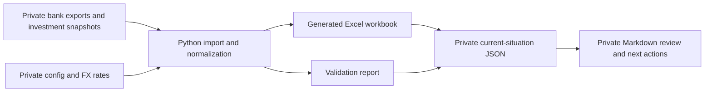

# How The Finance System Works

The repository has two connected layers: a calculation pipeline that produces
the workbook, and a vault layer that records the current situation in a compact
form.

The code does not currently generate the JSON or Markdown snapshot. They are a
manual, point-in-time summary of verified workbook values. Automating that step
would be an application change and should not be assumed from this documentation.

## What Each Layer Answers

| Layer | Main question |
| --- | --- |
| Raw exports | What did each institution report? |
| Normalized transactions | How can different exports be compared consistently? |
| Workbook | What are the calculated totals, trends, categories, and investment values? |
| Validation report | Which inputs, rates, duplicates, or classifications need review? |
| JSON snapshot | What is the structured financial position as of one date? |
| Markdown review | What changed, what matters, and what should happen next? |

For implementation details, see the
[pipeline architecture](../docs/architecture/pipeline.md).

## Core Definitions

| Metric | Definition |
| --- | --- |
| Cash and bank | Verified liquid balances included in the snapshot. |
| Investments | Latest verified market or statement value of included investments. |
| Other assets | Included assets that are neither liquid cash nor investments. |
| Liabilities | Outstanding obligations, stored as positive amounts. |
| Net worth | Cash and bank + investments + other assets - liabilities. |
| Net cash flow | Income - expenses for the stated period. |
| Savings rate | Net cash flow divided by income, multiplied by 100; leave `null` when income is zero or unknown. |
| Runway | Emergency fund divided by monthly essential expenses; leave `null` when the denominator is zero or unknown. |

These definitions organize personal records; they are not financial advice.

## Snapshot Status

- `not_populated` - structure exists but figures have not been entered.
- `partial` - some figures are verified, but coverage is incomplete.
- `current` - the as-of date, included sources, figures, and validation state are
  all known.
- `stale` - the snapshot was once usable but no longer represents the intended
  review date.

Validation status is separate from snapshot status. A snapshot can be recent
and still have warnings that need to be recorded.

## Refresh Routine

1. Decide the snapshot date and reporting period.
2. Confirm which accounts, banks, investments, and liabilities are included.
3. Run the normal or offline workbook build as appropriate.
4. Review `reports/validation_summary.md`; resolve or record material warnings.
5. Read aggregate values from the workbook dashboards and relevant summary
   sheets.
6. Update `finance/private/current-situation.json` first.
7. Update `finance/private/current-situation.md` with changes, risks, decisions,
   and next actions.
8. Recheck that the private files remain ignored before any commit.

Tags: #finance/workbook #finance/snapshot #finance/validation #finance/privacy
